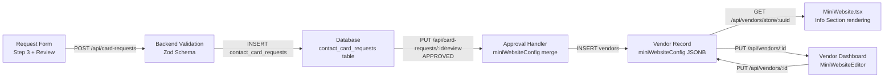

# Design Document: Vendor Contact Card Customization

## Overview

This feature replaces three hardcoded placeholder strings in `MiniWebsite.tsx` — "The Maison", "Heritage & Elegance", and a static about paragraph — with vendor-supplied values that flow through the entire data pipeline: request form → backend validation → database storage → approval propagation → live rendering → post-approval editing.

The three new text properties are:

| Property | Field Name | Max Length | Fallback |
|---|---|---|---|
| Business Label | `businessLabel` | 100 chars | `vendor.name` |
| Tagline | `tagline` | 150 chars | `vendor.shortDescription`, then omit |
| About Description | `aboutDescription` | 1000 chars | `vendor.description`, then `vendor.shortDescription` |

All three are optional at every stage. No existing functionality is broken; the feature is purely additive.

---

## Architecture

The change touches five layers in sequence:



No new routes are introduced. All changes are additive modifications to existing files.

---

## Components and Interfaces

### 1. Database Schema — `contact_card_requests`

Three new nullable `text` / `varchar` columns are added to `packages/database/src/schema/contactCardRequests.ts`:

```typescript
businessLabel: varchar('business_label', { length: 100 }),
tagline: varchar('tagline', { length: 150 }),
aboutDescription: text('about_description'),
```

A Drizzle migration is required. The columns are nullable with no default, matching the optional nature of the fields.

### 2. Backend Validation — `cardRequestSchema` (Zod)

Three optional fields are added to the `body` object inside `cardRequestSchema` in `apps/backend/src/routes/contactCardRequestRoutes.ts`:

```typescript
businessLabel: z.string().max(100, 'Business label must be 100 characters or fewer').optional(),
tagline: z.string().max(150, 'Tagline must be 150 characters or fewer').optional(),
aboutDescription: z.string().max(1000, 'About description must be 1000 characters or fewer').optional(),
```

The existing `validate` middleware already returns HTTP 400 with Zod error details when validation fails, so no additional error-handling code is needed.

### 3. POST Handler — `contactCardRequestRoutes.ts`

The destructuring block and the `db.insert` call are extended to include the three new fields:

```typescript
// Destructure
const { ..., businessLabel, tagline, aboutDescription } = req.body;

// Insert
businessLabel: businessLabel || null,
tagline: tagline || null,
aboutDescription: aboutDescription || null,
```

### 4. Approval Handler — `PUT /api/card-requests/:id/review`

Inside the `APPROVED` transaction, the `miniConfig` object construction is extended:

```typescript
const miniConfig: Record<string, any> = {};
if (existingRequest.googleDirectionLink) miniConfig.googleMapsUrl = existingRequest.googleDirectionLink;
if (existingRequest.businessLabel)    miniConfig.businessLabel    = existingRequest.businessLabel;
if (existingRequest.tagline)          miniConfig.tagline          = existingRequest.tagline;
if (existingRequest.aboutDescription) miniConfig.aboutDescription = existingRequest.aboutDescription;
```

The conditional guards ensure `null` values are never written as keys, satisfying Requirement 3.4. All other `miniWebsiteConfig` fields (theme, socialLinks, etc.) are unaffected because the vendor is newly created at this point and `miniConfig` is the initial value.

### 5. Vendor Update Endpoint — `PUT /api/vendors/:id`

The existing vendor update route (in `apps/backend/src/routes/vendorRoutes.ts`) already accepts a `miniWebsiteConfig` JSONB payload and merges it. Validation for the three new sub-fields is added:

```typescript
if (miniWebsiteConfig?.businessLabel !== undefined) {
    if (typeof miniWebsiteConfig.businessLabel !== 'string' || miniWebsiteConfig.businessLabel.length > 100) {
        return res.status(400).json({ error: 'businessLabel must be a string of 100 characters or fewer' });
    }
}
// same pattern for tagline (150) and aboutDescription (1000)
```

### 6. Frontend Types — `types.ts`

`MiniWebsiteConfig` gains three optional fields:

```typescript
export interface MiniWebsiteConfig {
    // ... existing fields ...
    businessLabel?: string;
    tagline?: string;
    aboutDescription?: string;
}
```

`ContactCardRequest` gains three optional nullable fields:

```typescript
businessLabel?: string | null;
tagline?: string | null;
aboutDescription?: string | null;
```

`FormData` in `request-card/page.tsx` gains three string fields (defaulting to `''`):

```typescript
businessLabel: string;
tagline: string;
aboutDescription: string;
```

### 7. Request Form — `apps/frontend/src/app/request-card/page.tsx`

**Step 3 (Business Information)** — three new fields are appended after the existing `shortDescription` field:

- `businessLabel` — `<input type="text" maxLength={100} />` with character counter
- `tagline` — `<input type="text" maxLength={150} />` with character counter
- `aboutDescription` — `<textarea maxLength={1000} />` with character counter

All three are optional (no `required` attribute, no validation in `validateStep(3)`).

**Payload construction** in `handleSubmit` — the three fields are included:

```typescript
businessLabel: formData.businessLabel || undefined,
tagline: formData.tagline || undefined,
aboutDescription: formData.aboutDescription || undefined,
```

**Review Step (`StepReview`)** — a new "Brand Copy" section is added to the review summary, showing the three values (or a `—` placeholder when empty) with an Edit button that calls `handleEdit(3)`.

### 8. Mini Website — `apps/frontend/src/components/MiniWebsite.tsx`

The Info Section is updated to use dynamic values with fallbacks:

```tsx
// Business Label
const businessLabel = vendor.miniWebsiteConfig?.businessLabel?.trim() || vendor.name;

// Tagline
const tagline = vendor.miniWebsiteConfig?.tagline?.trim()
    || vendor.shortDescription?.trim()
    || null;

// About Description
const aboutDescription = vendor.miniWebsiteConfig?.aboutDescription?.trim()
    || vendor.description?.trim()
    || vendor.shortDescription?.trim()
    || null;
```

The JSX replaces the hardcoded strings:

```tsx
<p className="text-sm tracking-[0.3em] uppercase text-gray-400 mb-4 font-semibold">
    {businessLabel}
</p>
{tagline && (
    <h3 className="font-serif text-4xl md:text-5xl mb-8 text-black leading-tight">
        {tagline}
    </h3>
)}
{aboutDescription && (
    <p className="text-gray-500 mb-10 leading-relaxed text-lg font-light max-w-lg">
        {aboutDescription}
    </p>
)}
```

### 9. Vendor Dashboard — `apps/frontend/src/components/vendor/MiniWebsiteEditor.tsx`

A new "Brand Copy" section is added to the editor, above the Social Presence section:

- `businessLabel` — `<input type="text" maxLength={100} />` with character counter, pre-populated from `config.businessLabel`
- `tagline` — `<input type="text" maxLength={150} />` with character counter, pre-populated from `config.tagline`
- `aboutDescription` — `<textarea maxLength={1000} />` with character counter, pre-populated from `config.aboutDescription`

The `handleSave` function already calls `updateVendor(vendor.id, { miniWebsiteConfig: config })`, so no additional save logic is needed — the three new fields are included automatically when `config` is spread.

---

## Data Models

### `contact_card_requests` table (additions)

| Column | Type | Nullable | Constraint |
|---|---|---|---|
| `business_label` | `varchar(100)` | YES | — |
| `tagline` | `varchar(150)` | YES | — |
| `about_description` | `text` | YES | — |

### `vendors.mini_website_config` JSONB (additions)

The existing JSONB column gains three optional keys:

```typescript
{
    // existing keys unchanged
    googleMapsUrl?: string;
    socialLinks?: { ... };
    theme?: { ... };
    customSections?: Array<...>;
    // new keys
    businessLabel?: string;    // max 100 chars
    tagline?: string;          // max 150 chars
    aboutDescription?: string; // max 1000 chars
}
```

No schema migration is needed for the `vendors` table — the JSONB column already exists and accepts arbitrary keys.

### Drizzle Migration

A single migration file is required to add the three columns to `contact_card_requests`:

```sql
ALTER TABLE contact_card_requests
    ADD COLUMN business_label  VARCHAR(100),
    ADD COLUMN tagline         VARCHAR(150),
    ADD COLUMN about_description TEXT;
```

---

## Correctness Properties

*A property is a characteristic or behavior that should hold true across all valid executions of a system — essentially, a formal statement about what the system should do. Properties serve as the bridge between human-readable specifications and machine-verifiable correctness guarantees.*

### Property 1: Character counter accuracy

*For any* string value assigned to `businessLabel`, `tagline`, or `aboutDescription` in the request form, the displayed character counter for that field SHALL equal the string's `.length`.

**Validates: Requirements 1.4**

---

### Property 2: Payload completeness

*For any* combination of non-empty `businessLabel`, `tagline`, and `aboutDescription` values entered in the request form, the POST body submitted to `/api/card-requests` SHALL contain those exact values under the corresponding keys.

**Validates: Requirements 1.6**

---

### Property 3: Schema length enforcement

*For any* string submitted as `businessLabel` with length > 100, or `tagline` with length > 150, or `aboutDescription` with length > 1000, the `cardRequestSchema` SHALL reject the value and the route SHALL return HTTP 400.

*For any* string submitted within the respective length limits, the schema SHALL accept it.

**Validates: Requirements 2.1, 2.2, 2.3, 2.6, 2.7, 2.8**

---

### Property 4: Request persistence round-trip

*For any* valid `(businessLabel, tagline, aboutDescription)` triple submitted to `POST /api/card-requests`, the values stored in the `contact_card_requests` row SHALL equal the submitted values (or `null` when omitted).

**Validates: Requirements 2.4, 2.5**

---

### Property 5: Approval propagation

*For any* approved `ContactCardRequest` with non-null `businessLabel`, `tagline`, or `aboutDescription` values, the resulting `Vendor` record's `miniWebsiteConfig` SHALL contain those values under the matching keys.

*For any* approved `ContactCardRequest` with a `null` value for any of the three fields, the resulting `miniWebsiteConfig` SHALL NOT contain a key for that field.

**Validates: Requirements 3.1, 3.2, 3.3, 3.4**

---

### Property 6: miniWebsiteConfig field preservation

*For any* `ContactCardRequest` approval where the `miniWebsiteConfig` already contains fields such as `googleMapsUrl`, `theme`, or `socialLinks`, those fields SHALL remain present and unchanged in the resulting `Vendor` record's `miniWebsiteConfig` after the three new keys are written.

**Validates: Requirements 3.5**

---

### Property 7: Mini Website rendering — no hardcoded strings

*For any* vendor data, the Info Section of `MiniWebsite.tsx` SHALL NOT render the literal strings "The Maison", "Heritage & Elegance", or the hardcoded about paragraph text.

**Validates: Requirements 4.7**

---

### Property 8: Mini Website rendering — correct value or fallback

*For any* vendor with a non-empty `miniWebsiteConfig.businessLabel`, the Info Section SHALL display that value. When `businessLabel` is absent or empty, the Info Section SHALL display `vendor.name`.

*For any* vendor with a non-empty `miniWebsiteConfig.tagline`, the Info Section SHALL display that value. When `tagline` is absent or empty and `shortDescription` is present, the Info Section SHALL display `shortDescription`. When both are absent, the tagline element SHALL be omitted.

*For any* vendor with a non-empty `miniWebsiteConfig.aboutDescription`, the Info Section SHALL display that value. When `aboutDescription` is absent or empty, the Info Section SHALL display `vendor.description` if present, otherwise `vendor.shortDescription`.

**Validates: Requirements 4.1, 4.2, 4.3, 4.4, 4.5, 4.6**

---

### Property 9: Dashboard pre-population

*For any* vendor whose `miniWebsiteConfig` contains `businessLabel`, `tagline`, or `aboutDescription` values, the corresponding input fields in `MiniWebsiteEditor` SHALL be pre-populated with those values when the component mounts.

**Validates: Requirements 5.1**

---

### Property 10: Dashboard save round-trip

*For any* valid `(businessLabel, tagline, aboutDescription)` values entered in `MiniWebsiteEditor` and saved, the `PUT /api/vendors/:id` request body SHALL include those values inside `miniWebsiteConfig`, and the vendor update endpoint SHALL persist them to the `Vendor` record.

**Validates: Requirements 5.2, 5.3**

---

### Property 11: Dashboard validation enforcement

*For any* `businessLabel` value exceeding 100 characters, `tagline` exceeding 150 characters, or `aboutDescription` exceeding 1000 characters submitted to `PUT /api/vendors/:id`, the endpoint SHALL return HTTP 400.

**Validates: Requirements 5.4, 5.5, 5.6**

---

### Property 12: Review step display

*For any* `(businessLabel, tagline, aboutDescription)` values in the form state (including empty strings), the Review step SHALL display each value or a placeholder when empty, and clicking the edit action for any of the three fields SHALL invoke `handleEdit(3)`.

**Validates: Requirements 6.1, 6.2, 6.3, 6.4**

---

## Error Handling

### Validation errors (HTTP 400)

- Zod schema rejects oversized strings before the handler runs. The existing `validate` middleware formats Zod errors into `{ error: string, details: ZodIssue[] }` and returns 400. No additional error handling is needed in the route handler.
- The vendor update endpoint performs inline length checks and returns `{ error: string }` with 400.

### Null / missing fields

- All three fields are optional at every layer. Missing fields in the POST body are treated as `undefined` by Zod (`.optional()`) and stored as `null` in the database.
- The approval handler uses conditional guards (`if (existingRequest.businessLabel)`) to avoid writing `null` keys into `miniWebsiteConfig`.
- The `MiniWebsite.tsx` rendering uses optional chaining and `.trim()` checks before falling back, so `undefined`, `null`, and empty strings all trigger the fallback path.

### Frontend character counters

- Character counters are purely presentational. The `maxLength` attribute on inputs/textareas enforces the hard limit at the browser level. The counter displays `value.length / maxLength` and turns red (or similar) when approaching the limit.

### Concurrent updates

- The vendor update endpoint performs a standard `UPDATE ... SET miniWebsiteConfig = $1 WHERE id = $2`. If two concurrent saves occur, the last write wins. This is acceptable for the current scale and matches the existing behavior for other `miniWebsiteConfig` fields.

---

## Testing Strategy

### Unit tests (example-based)

- **`cardRequestSchema` validation**: test that valid payloads (with and without the three fields) pass, and that oversized values return the correct Zod error.
- **Approval handler**: test that `miniWebsiteConfig` is built correctly for all combinations of null/non-null fields, and that existing config fields are preserved.
- **`MiniWebsite.tsx` Info Section**: test each fallback path with concrete vendor fixtures.
- **`MiniWebsiteEditor`**: test that fields are pre-populated from `config` and that the save payload includes the three new keys.
- **`StepReview`**: test that the Brand Copy section renders values and placeholders correctly, and that the edit button calls `handleEdit(3)`.

### Property-based tests (fast-check)

The project uses Jest. Property-based tests are written using [fast-check](https://fast-check.dev/), which integrates directly with Jest via `fc.assert(fc.property(...))`.

Each property test runs a minimum of 100 iterations.

Tag format: `// Feature: vendor-contact-card-customization, Property N: <property text>`

**Property 3 — Schema length enforcement**

```typescript
// Feature: vendor-contact-card-customization, Property 3: Schema length enforcement
fc.assert(fc.property(
    fc.string({ maxLength: 100 }),
    fc.string({ maxLength: 150 }),
    fc.string({ maxLength: 1000 }),
    (bl, tl, ad) => {
        const result = cardRequestBodySchema.safeParse({ ...validBase, businessLabel: bl, tagline: tl, aboutDescription: ad });
        return result.success === true;
    }
), { numRuns: 100 });

fc.assert(fc.property(
    fc.string({ minLength: 101 }),
    (bl) => {
        const result = cardRequestBodySchema.safeParse({ ...validBase, businessLabel: bl });
        return result.success === false;
    }
), { numRuns: 100 });
// similar for tagline > 150 and aboutDescription > 1000
```

**Property 4 — Request persistence round-trip**

```typescript
// Feature: vendor-contact-card-customization, Property 4: Request persistence round-trip
fc.assert(fc.property(
    fc.option(fc.string({ maxLength: 100 }), { nil: undefined }),
    fc.option(fc.string({ maxLength: 150 }), { nil: undefined }),
    fc.option(fc.string({ maxLength: 1000 }), { nil: undefined }),
    async (bl, tl, ad) => {
        const stored = await insertAndFetch({ ...validBase, businessLabel: bl, tagline: tl, aboutDescription: ad });
        return stored.businessLabel === (bl ?? null)
            && stored.tagline === (tl ?? null)
            && stored.aboutDescription === (ad ?? null);
    }
), { numRuns: 100 });
```

**Property 5 — Approval propagation**

```typescript
// Feature: vendor-contact-card-customization, Property 5: Approval propagation
fc.assert(fc.property(
    fc.option(fc.string({ minLength: 1, maxLength: 100 }), { nil: null }),
    fc.option(fc.string({ minLength: 1, maxLength: 150 }), { nil: null }),
    fc.option(fc.string({ minLength: 1, maxLength: 1000 }), { nil: null }),
    (bl, tl, ad) => {
        const miniConfig = buildMiniConfig({ businessLabel: bl, tagline: tl, aboutDescription: ad });
        if (bl !== null) assert(miniConfig.businessLabel === bl);
        else assert(!('businessLabel' in miniConfig));
        if (tl !== null) assert(miniConfig.tagline === tl);
        else assert(!('tagline' in miniConfig));
        if (ad !== null) assert(miniConfig.aboutDescription === ad);
        else assert(!('aboutDescription' in miniConfig));
        return true;
    }
), { numRuns: 100 });
```

**Property 8 — Mini Website rendering**

```typescript
// Feature: vendor-contact-card-customization, Property 8: Mini Website rendering — correct value or fallback
fc.assert(fc.property(
    fc.record({
        businessLabel: fc.option(fc.string({ minLength: 1, maxLength: 100 }), { nil: undefined }),
        tagline: fc.option(fc.string({ minLength: 1, maxLength: 150 }), { nil: undefined }),
        aboutDescription: fc.option(fc.string({ minLength: 1, maxLength: 1000 }), { nil: undefined }),
        name: fc.string({ minLength: 1 }),
        shortDescription: fc.option(fc.string({ minLength: 1 }), { nil: undefined }),
        description: fc.option(fc.string({ minLength: 1 }), { nil: undefined }),
    }),
    (vendorData) => {
        const { container } = render(<InfoSection vendor={buildVendor(vendorData)} />);
        // businessLabel fallback
        const expectedLabel = vendorData.businessLabel?.trim() || vendorData.name;
        expect(container).toHaveTextContent(expectedLabel);
        // no hardcoded strings
        expect(container).not.toHaveTextContent('The Maison');
        expect(container).not.toHaveTextContent('Heritage & Elegance');
        return true;
    }
), { numRuns: 100 });
```

### Integration tests

- End-to-end flow: submit a request with all three fields → approve → fetch the vendor by UUID → verify `miniWebsiteConfig` contains the correct values.
- Vendor dashboard update: PUT `miniWebsiteConfig` with the three fields → fetch vendor → verify stored values.

### Test file locations

| Test | File |
|---|---|
| Schema validation (unit + property) | `apps/backend/src/__tests__/contactCardRequestRoutes.test.ts` |
| Approval handler (unit + property) | `apps/backend/src/__tests__/contactCardRequestRoutes.test.ts` |
| Vendor update validation (unit + property) | `apps/backend/src/__tests__/vendorRoutes.test.ts` |
| MiniWebsite rendering (unit + property) | `apps/frontend/src/__tests__/MiniWebsite.test.tsx` |
| MiniWebsiteEditor (unit) | `apps/frontend/src/__tests__/MiniWebsiteEditor.test.tsx` |
| StepReview (unit) | `apps/frontend/src/__tests__/RequestCardPage.test.tsx` |
