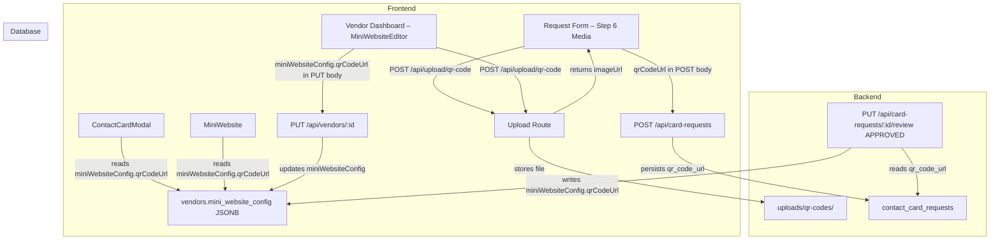

# Design Document: Vendor QR Code Payment

## Overview

This feature adds optional UPI/payment QR code support to the Gocal platform. Vendors can upload a QR code image at two points: during the initial contact card request form (Step 6 – Media), and at any time via the vendor dashboard. Once present on a vendor record, the QR code is displayed on both the Contact Card Modal and the Mini Website so customers can scan and pay directly.

The feature is additive and non-breaking. All new fields are optional, and existing vendor records without a QR code continue to work unchanged.

### Key Design Decisions

- **Storage location**: The QR code URL is stored in `vendors.mini_website_config` under the key `qrCodeUrl` (consistent with how `googleMapsUrl`, `businessLabel`, etc. are stored). For the card request, a new `qr_code_url` column is added to `contact_card_requests` so the URL survives the pending → approved transition.
- **Dedicated upload endpoint**: A new `POST /api/upload/qr-code` endpoint stores files in `uploads/qr-codes/`, keeping QR images separate from logos, gallery images, and product images — consistent with the existing upload pattern.
- **No new database table**: QR code data fits naturally into the existing JSONB `mini_website_config` column and the existing `contact_card_requests` table with a new column.
- **Display on both surfaces**: The QR code section is rendered conditionally on both `ContactCardModal` and `MiniWebsite` — only when `miniWebsiteConfig.qrCodeUrl` is a non-empty string.

---

## Architecture



### Data Flow Summary

1. **Request form**: Vendor uploads QR image → backend stores in `uploads/qr-codes/` → returns URL → form stores URL in state → on submit, URL is included in POST body → persisted to `contact_card_requests.qr_code_url`.
2. **Approval**: Admin approves request → approval handler reads `qr_code_url` from request → writes it into `miniWebsiteConfig.qrCodeUrl` on the new vendor record.
3. **Dashboard**: Vendor uploads new QR image → URL returned → vendor saves settings → PUT request updates `vendors.mini_website_config.qrCodeUrl`.
4. **Display**: `ContactCardModal` and `MiniWebsite` read `vendor.miniWebsiteConfig?.qrCodeUrl` and conditionally render the QR section.

---

## Components and Interfaces

### Backend

#### 1. Upload Route (`apps/backend/src/routes/uploadRoutes.ts`)

New endpoint added following the existing pattern:

```
POST /api/upload/qr-code
  - Auth: required (authenticate middleware)
  - Field name: image (single file)
  - Storage: uploads/qr-codes/
  - Max size: 5 MB
  - Accepted types: jpeg, jpg, png, webp, gif
  - Response: { imageUrl: string }
  - Errors: 400 (wrong type), 401 (unauthenticated), 413 (too large)
```

Static serving of `uploads/qr-codes/` must be registered in `apps/backend/src/index.ts` alongside the existing static paths.

#### 2. Card Request Route (`apps/backend/src/routes/contactCardRequestRoutes.ts`)

- `cardRequestSchema` gains an optional `qrCodeUrl` field: `z.string().url().optional().or(z.literal('').transform(() => undefined))`
- The `POST /api/card-requests` handler reads `qrCodeUrl` from the validated body and persists it to `contact_card_requests.qr_code_url`.
- The approval handler (`PUT /api/card-requests/:id/review`) reads `existingRequest.qrCodeUrl` and, if non-null, sets `miniConfig.qrCodeUrl = existingRequest.qrCodeUrl` before inserting the vendor record.

#### 3. Vendor Route (`apps/backend/src/routes/vendorRoutes.ts`)

The existing `PUT /api/vendors/:id` handler already accepts `miniWebsiteConfig` as a partial update. A validation check is added for `miniWebsiteConfig.qrCodeUrl`:

```typescript
if (miniWebsiteConfig?.qrCodeUrl !== undefined && miniWebsiteConfig.qrCodeUrl !== null) {
    if (typeof miniWebsiteConfig.qrCodeUrl !== 'string' || !isValidUrl(miniWebsiteConfig.qrCodeUrl)) {
        return res.status(400).json({ error: 'qrCodeUrl must be a valid URL' });
    }
}
```

### Database

#### `contact_card_requests` table

New column added via Drizzle migration:

```typescript
qrCodeUrl: text('qr_code_url'),  // nullable, stores the QR code image URL
```

No change to the `vendors` table — `qrCodeUrl` is stored inside the existing `mini_website_config` JSONB column.

### Frontend

#### 1. `Step6Media` in `apps/frontend/src/app/request-card/page.tsx`

A new QR code upload section is added to the existing Step 6 Media component. It follows the same upload pattern as the logo and main photo fields:

- File input (accept: `image/*`) triggers `POST /api/upload/qr-code`
- On success: preview image shown, URL stored in `formData.qrCodeUrl`
- On failure: error message shown, other form data preserved
- Helper text: "Recommended — helps customers pay you directly. You can change this later."
- Field is optional; no validation error if absent

#### 2. `FormData` type in `request-card/page.tsx`

```typescript
export interface FormData {
  // ... existing fields ...
  qrCodeUrl: string;  // new field, defaults to ''
}

export const initialFormData: FormData = {
  // ... existing fields ...
  qrCodeUrl: '',
};
```

#### 3. `StepReview` in `request-card/page.tsx`

The review step summary gains a QR code row:
- If `formData.qrCodeUrl` is non-empty: shows a thumbnail preview and an edit button that navigates to step 6
- If empty: shows a placeholder ("No QR code uploaded") or omits the row

#### 4. `ContactCardModal` (`apps/frontend/src/components/ContactCardModal.tsx`)

A new conditional section is added in the content area (after Contact Details, before Featured Products):

```tsx
{vendor.miniWebsiteConfig?.qrCodeUrl && (
  <div className="mb-6">
    <h3 className="font-serif text-lg font-bold text-luxury-black mb-3">Scan to Pay</h3>
    <div className="flex justify-center p-4 bg-luxury-cream rounded-xl border" style={{ borderColor: accentColor + '40' }}>
      <Image
        src={vendor.miniWebsiteConfig.qrCodeUrl}
        alt="Payment QR Code"
        width={200}
        height={200}
        className="rounded-lg"
      />
    </div>
  </div>
)}
```

Minimum rendered size: 160×160 CSS pixels (200×200 used for comfortable scanning).

#### 5. `MiniWebsite` (`apps/frontend/src/components/MiniWebsite.tsx`)

A QR code section is added to the Home tab's info section (alongside Location, Hours, and Contact):

```tsx
{vendor.miniWebsiteConfig?.qrCodeUrl && (
  <div className="flex items-start gap-5">
    <div className="w-12 h-12 rounded-full bg-gray-50 flex items-center justify-center flex-shrink-0">
      <QrCode className="w-5 h-5 text-black" />
    </div>
    <div>
      <p className="font-bold text-black tracking-widest uppercase text-xs mb-3">Scan to Pay</p>
      <Image
        src={vendor.miniWebsiteConfig.qrCodeUrl}
        alt="Payment QR Code"
        width={200}
        height={200}
        className="rounded-lg border border-gray-100"
      />
    </div>
  </div>
)}
```

#### 6. `MiniWebsiteEditor` (`apps/frontend/src/components/vendor/MiniWebsiteEditor.tsx`)

A new QR code section is added to the editor, placed after the Brand Copy section:

- Displays current QR code preview if `config.qrCodeUrl` is set
- Upload button triggers `POST /api/upload/qr-code`
- "Remove" button sets `config.qrCodeUrl` to `null`/`undefined`
- Helper text: "Recommended — helps customers pay you directly. You can change this anytime."
- Saved via the existing `handleSave` → `updateVendor` call

#### 7. `MiniWebsiteConfig` type (`apps/frontend/src/types.ts`)

```typescript
export interface MiniWebsiteConfig {
  // ... existing fields ...
  qrCodeUrl?: string;  // new optional field
}
```

---

## Data Models

### `contact_card_requests` table (updated)

| Column | Type | Nullable | Notes |
|--------|------|----------|-------|
| `qr_code_url` | `text` | YES | New column. URL of the uploaded QR code image. |

All other columns unchanged.

### `vendors.mini_website_config` JSONB (updated shape)

```typescript
{
  socialLinks?: { ... };
  googleMapsUrl?: string;
  customSections?: Array<{ title: string; content: string }>;
  theme?: { ... };
  businessLabel?: string;
  tagline?: string;
  aboutDescription?: string;
  qrCodeUrl?: string;  // NEW — URL of the vendor's payment QR code image
}
```

### Drizzle Schema Changes

**`packages/database/src/schema/contactCardRequests.ts`** — add one column:

```typescript
qrCodeUrl: text('qr_code_url'),
```

**`packages/database/src/schema/vendors.ts`** — update the JSDoc comment on `miniWebsiteConfig` to document the new `qrCodeUrl` key. No schema change needed (it's JSONB).

### Migration

A new Drizzle migration file adds the `qr_code_url` column to `contact_card_requests`:

```sql
ALTER TABLE contact_card_requests ADD COLUMN qr_code_url text;
```

---

## Correctness Properties

*A property is a characteristic or behavior that should hold true across all valid executions of a system — essentially, a formal statement about what the system should do. Properties serve as the bridge between human-readable specifications and machine-verifiable correctness guarantees.*

### Property 1: Form state captures uploaded QR URL

*For any* valid URL string returned by the QR code upload endpoint, after the upload completes successfully, the form state's `qrCodeUrl` field must equal that exact URL.

**Validates: Requirements 1.5**

---

### Property 2: Submitted form payload includes QR URL

*For any* non-empty `qrCodeUrl` value in the form state, the POST body sent to `/api/card-requests` on form submission must include a `qrCodeUrl` field equal to that value.

**Validates: Requirements 1.6**

---

### Property 3: File type acceptance is consistent

*For any* file whose MIME type is one of `{image/jpeg, image/png, image/webp, image/gif}`, the QR code upload field must accept it. *For any* file whose MIME type is not in that set, the upload field must reject it with a validation error.

**Validates: Requirements 1.8, 1.9**

---

### Property 4: Schema accepts valid URLs and rejects invalid ones

*For any* string that is a syntactically valid URL, `cardRequestSchema` must accept it as a valid `qrCodeUrl`. *For any* string that is not a valid URL, `cardRequestSchema` must reject it with a validation error.

**Validates: Requirements 2.1, 2.4**

---

### Property 5: QR URL round-trip through card request persistence

*For any* valid `qrCodeUrl` submitted in a POST to `/api/card-requests`, the created `ContactCardRequest` record retrieved from the database must have a `qrCodeUrl` field equal to the submitted value.

**Validates: Requirements 2.2**

---

### Property 6: QR URL propagates to vendor record on approval

*For any* `ContactCardRequest` with a non-null `qrCodeUrl`, after the request is approved, the created vendor record's `miniWebsiteConfig.qrCodeUrl` must equal the request's `qrCodeUrl`.

**Validates: Requirements 3.1**

---

### Property 7: Approval preserves existing miniWebsiteConfig fields

*For any* combination of fields set in the request's brand copy (`googleDirectionLink`, `businessLabel`, `tagline`, `aboutDescription`), after approval, all those fields must still be present in the vendor's `miniWebsiteConfig` alongside `qrCodeUrl`.

**Validates: Requirements 3.3**

---

### Property 8: ContactCardModal renders QR section iff qrCodeUrl is non-empty

*For any* vendor object, the `ContactCardModal` must render a QR code image element if and only if `vendor.miniWebsiteConfig?.qrCodeUrl` is a non-empty string.

**Validates: Requirements 4.1, 4.2**

---

### Property 9: MiniWebsite renders QR section iff qrCodeUrl is non-empty

*For any* vendor object, the `MiniWebsite` component must render a QR code image element if and only if `vendor.miniWebsiteConfig?.qrCodeUrl` is a non-empty string.

**Validates: Requirements 5.1, 5.2**

---

### Property 10: Upload endpoint returns URL in qr-codes path

*For any* valid image file uploaded to `POST /api/upload/qr-code`, the response JSON must contain an `imageUrl` field whose value includes the path segment `/uploads/qr-codes/`.

**Validates: Requirements 7.3**

---

### Property 11: Review step shows QR thumbnail iff qrCodeUrl is non-empty

*For any* form state, the review step must render a QR code thumbnail image if and only if `formData.qrCodeUrl` is a non-empty string.

**Validates: Requirements 8.1, 8.2**

---

## Error Handling

| Scenario | Component | Behavior |
|----------|-----------|----------|
| QR upload fails (network/server error) | Request Form Step 6, Dashboard MiniWebsiteEditor | Show inline error message; preserve all other form/config state; allow retry |
| Non-image file selected for QR upload | Request Form Step 6, Dashboard MiniWebsiteEditor | Client-side file type validation rejects file; show error; no upload request sent |
| File exceeds 5 MB | Upload Route | Return HTTP 413 with message "Image must be smaller than 5 MB"; frontend shows error |
| Invalid file type reaches server | Upload Route | Return HTTP 400 with message "Only image files (jpeg, jpg, png, webp, gif) are allowed" |
| Invalid `qrCodeUrl` in card request body | Card Request Route | Zod validation returns HTTP 400 with field-level error |
| Invalid `qrCodeUrl` in vendor PUT body | Vendor Route | Return HTTP 400 with message "qrCodeUrl must be a valid URL" |
| `qrCodeUrl` is null/absent in card request | Approval Handler | `qrCodeUrl` key is omitted from `miniWebsiteConfig`; no error |
| QR image URL is broken/unreachable | ContactCardModal, MiniWebsite | Next.js `<Image>` renders with broken image indicator; no crash |

---

## Testing Strategy

### Unit Tests

Unit tests cover specific examples, edge cases, and error conditions:

- **Upload Route**: unauthenticated request returns 401; oversized file returns 413; non-image file returns 400; valid image returns 201 with `imageUrl` containing `/uploads/qr-codes/`.
- **Card Request Schema**: `qrCodeUrl` absent → valid; `qrCodeUrl` = valid URL → valid; `qrCodeUrl` = empty string → coerced to undefined; `qrCodeUrl` = non-URL string → 400.
- **Approval Handler**: request with `qrCodeUrl` → vendor has `miniWebsiteConfig.qrCodeUrl`; request with null `qrCodeUrl` → vendor `miniWebsiteConfig` has no `qrCodeUrl` key; existing config fields preserved.
- **Vendor PUT Route**: valid `qrCodeUrl` → 200; invalid `qrCodeUrl` → 400; `qrCodeUrl: null` → 200 (removal).
- **ContactCardModal**: renders QR section with non-empty URL; does not render QR section with absent/empty URL; label "Scan to Pay" present; image size ≥ 160px.
- **MiniWebsite**: same conditional rendering checks as ContactCardModal.
- **Step6Media**: QR upload section present; helper text present; optional (no error without QR); upload success shows preview; upload failure shows error without losing other fields.
- **StepReview**: QR thumbnail shown when `qrCodeUrl` non-empty; omitted when empty; edit button navigates to step 6.

### Property-Based Tests

Property-based tests use a PBT library (e.g., `fast-check` for TypeScript) with a minimum of 100 iterations per property. Each test is tagged with the feature and property number.

```
// Feature: vendor-qr-code-payment, Property 4: Schema accepts valid URLs and rejects invalid ones
// Feature: vendor-qr-code-payment, Property 5: QR URL round-trip through card request persistence
// Feature: vendor-qr-code-payment, Property 8: ContactCardModal renders QR section iff qrCodeUrl is non-empty
// Feature: vendor-qr-code-payment, Property 9: MiniWebsite renders QR section iff qrCodeUrl is non-empty
// Feature: vendor-qr-code-payment, Property 11: Review step shows QR thumbnail iff qrCodeUrl is non-empty
```

Properties 1, 2, 3, 6, 7, and 10 are best covered by focused unit/integration tests given their interaction with file I/O, HTTP, and database state.

### Integration Tests

- End-to-end flow: upload QR → submit card request → admin approves → vendor record has `qrCodeUrl` in `miniWebsiteConfig`.
- Dashboard flow: vendor uploads QR → saves settings → GET `/api/vendors/me` returns updated `miniWebsiteConfig.qrCodeUrl`.
- Static file serving: upload QR → GET returned `imageUrl` → 200 response.
