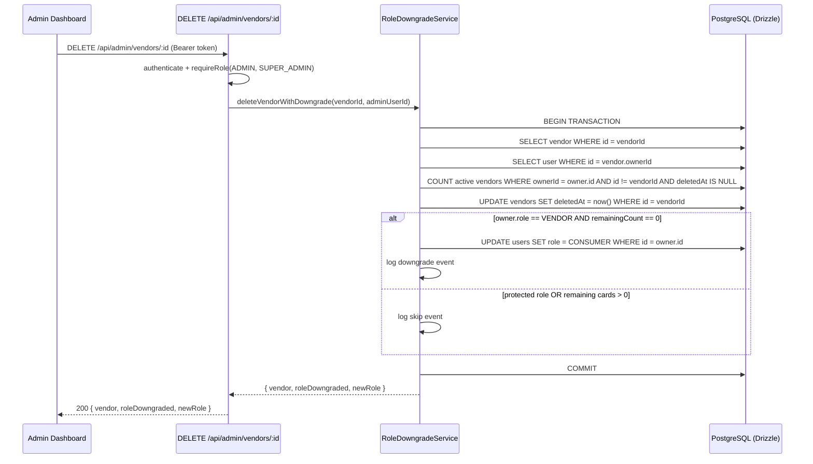

# Design Document: vendor-role-auto-downgrade

## Overview

This feature adds automatic role downgrade logic to the admin vendor-card deletion flow. When an admin soft-deletes a vendor card, the system checks whether the card's owner should be demoted from `VENDOR` to `CONSUMER`. The downgrade only happens when: (a) the owner's role is `VENDOR` (not a protected role), and (b) the owner has no remaining active vendor cards after the deletion. The soft-delete and role update are performed atomically in a single DB transaction.

Additionally, the existing restriction that blocks `VENDOR`-role users from submitting new contact card requests is removed, so any authenticated user can request additional cards as long as they have no pending request.

## Architecture

The feature touches three layers:

```
Frontend (Admin Dashboard)
        │
        │  DELETE /api/admin/vendors/:id
        ▼
Backend Route (adminVendorRoutes.ts)
        │
        │  calls
        ▼
RoleDowngradeService (services/roleDowngradeService.ts)
        │
        │  db.transaction()
        ▼
Database (vendors + users tables via Drizzle ORM)
```

The existing `DELETE /api/vendors/:id` route is **not modified** — it remains for owner self-deletion with no role logic. A new dedicated admin endpoint is added at `DELETE /api/admin/vendors/:id` that enforces `ADMIN | SUPER_ADMIN` and triggers the downgrade service.

The VENDOR-role block in `contactCardRequestRoutes.ts` is removed so any authenticated user can submit a new card request.



## Components and Interfaces

### New: `apps/backend/src/services/roleDowngradeService.ts`

```typescript
export interface DowngradeResult {
  vendor: Vendor;
  roleDowngraded: boolean;
  newRole: string;
  previousRole: string;
}

export async function deleteVendorWithDowngrade(
  vendorId: string,
  adminUserId: string
): Promise<DowngradeResult>
```

Responsibilities:
- Fetch the vendor and its owner inside a transaction
- Count remaining active cards for the owner (excluding the one being deleted)
- Soft-delete the vendor (`deletedAt = now()`)
- Conditionally update the owner's role to `CONSUMER`
- Emit structured log entries for downgrade and skip events
- Return a `DowngradeResult` to the route handler

### New: `apps/backend/src/routes/adminVendorRoutes.ts`

Single route:

```
DELETE /api/admin/vendors/:id
  middleware: authenticate, requireRole('ADMIN', 'SUPER_ADMIN')
  handler: calls deleteVendorWithDowngrade, returns DowngradeResult
```

### Modified: `apps/backend/src/routes/contactCardRequestRoutes.ts`

Remove the block at the top of `POST /api/card-requests` that rejects users with `role === 'VENDOR'`. The only remaining guard is the existing PENDING-request check.

### Modified: `apps/backend/src/index.ts`

Register the new admin vendor router:

```typescript
import adminVendorRoutes from './routes/adminVendorRoutes';
app.use('/api/admin/vendors', adminVendorRoutes);
```

### Frontend: Admin Dashboard

The admin dashboard's vendor delete action should be updated to call `DELETE /api/admin/vendors/:id` instead of (or in addition to) the existing endpoint, and handle the `roleDowngraded` flag in the response to show a toast/notification.

## Data Models

No schema changes are required. The feature uses existing columns:

| Table     | Column      | Usage                                      |
|-----------|-------------|--------------------------------------------|
| `vendors` | `id`        | Identify the card being deleted            |
| `vendors` | `ownerId`   | Look up the owner                          |
| `vendors` | `deletedAt` | Soft-delete timestamp (set to `now()`)     |
| `users`   | `id`        | Identify the owner                         |
| `users`   | `role`      | Read current role; conditionally update    |

Query for remaining active cards:

```sql
SELECT COUNT(*) FROM vendors
WHERE owner_id = $ownerId
  AND id != $vendorId
  AND deleted_at IS NULL;
```

## Correctness Properties

*A property is a characteristic or behavior that should hold true across all valid executions of a system — essentially, a formal statement about what the system should do. Properties serve as the bridge between human-readable specifications and machine-verifiable correctness guarantees.*

### Property 1: Role downgrade correctness

*For any* vendor card and its owner, after an admin deletes the card and the owner has zero remaining active cards: if the owner's role was `VENDOR`, their role becomes `CONSUMER`; if the owner's role was anything else (`ADMIN`, `SUPER_ADMIN`, `CONSUMER`), their role is unchanged.

**Validates: Requirements 1.1, 1.2, 1.3, 1.4**

### Property 2: Multi-card guard

*For any* owner with N ≥ 1 active vendor cards, deleting any single card when N > 1 (i.e., at least one card remains) must leave the owner's role unchanged, regardless of what that role is.

**Validates: Requirements 2.1, 2.2, 2.3**

### Property 3: Transaction atomicity

*For any* vendor card deletion, the soft-delete of the vendor and the role update (if applicable) either both succeed or both do not take effect — the system must never be in a state where the vendor is soft-deleted but the role was not updated (or vice versa).

**Validates: Requirements 3.1, 3.2, 3.3**

### Property 4: Admin-only authorization

*For any* request to `DELETE /api/admin/vendors/:id`, the request succeeds (2xx) if and only if the authenticated user holds the role `ADMIN` or `SUPER_ADMIN`; all other roles receive HTTP 403.

**Validates: Requirements 4.1, 4.2, 4.3**

### Property 5: Audit log completeness

*For any* vendor card deletion processed by `RoleDowngradeService`, a log entry is emitted that includes the vendor card ID and the owner user ID; if a downgrade occurred, the log also includes the previous role and new role; if skipped, the log includes the reason (protected role or remaining card count).

**Validates: Requirements 5.1, 5.2, 5.3**

### Property 6: API response shape

*For any* successful call to `DELETE /api/admin/vendors/:id`, the response body contains a boolean `roleDowngraded` field; when `roleDowngraded` is `true`, the response also contains the `newRole` value.

**Validates: Requirements 6.1, 6.2**

## Error Handling

| Scenario | HTTP Status | Behaviour |
|---|---|---|
| Vendor not found | 404 | Return `{ error: 'Vendor not found' }` before starting transaction |
| Vendor already soft-deleted | 409 | Return `{ error: 'Vendor already deleted' }` |
| Unauthenticated request | 401 | `authenticate` middleware rejects |
| Non-admin role | 403 | `requireRole` middleware rejects |
| DB transaction failure | 500 | Transaction rolled back; return `{ error: 'Failed to delete vendor. Changes rolled back.' }` |
| Owner user record missing | 500 | Treat as transaction failure; roll back and log |

The service throws typed errors that the route handler catches and maps to HTTP responses. No partial state is ever committed.

## Testing Strategy

### Unit Tests

Focus on specific examples and edge cases:

- `RoleDowngradeService` with a mocked `db.transaction`:
  - Owner is `VENDOR` with 0 remaining cards → role updated to `CONSUMER`, `roleDowngraded: true`
  - Owner is `VENDOR` with 1 remaining card → role unchanged, `roleDowngraded: false`
  - Owner is `ADMIN` with 0 remaining cards → role unchanged, `roleDowngraded: false`
  - Owner is `SUPER_ADMIN` with 0 remaining cards → role unchanged, `roleDowngraded: false`
  - Owner is `CONSUMER` with 0 remaining cards → role unchanged, `roleDowngraded: false`
  - Vendor not found → throws / returns 404
  - Vendor already deleted → throws / returns 409
- Route handler:
  - Non-admin caller → 403
  - Unauthenticated → 401
  - Successful deletion with downgrade → 200 with `roleDowngraded: true` and `newRole`
  - Successful deletion without downgrade → 200 with `roleDowngraded: false`
- `contactCardRequestRoutes` POST:
  - `VENDOR`-role user with no pending request → 201 (no longer blocked)
  - Any user with existing PENDING request → 409

### Property-Based Tests

Use **fast-check** (already compatible with the Jest setup in this monorepo).

Each property test runs a minimum of **100 iterations**.

Tag format: `Feature: vendor-role-auto-downgrade, Property {N}: {property_text}`

**Property 1 test** — Role downgrade correctness:
Generate: random `ownerId`, random `role` from `['VENDOR', 'ADMIN', 'SUPER_ADMIN', 'CONSUMER']`, `remainingCards = 0`.
Assert: after `deleteVendorWithDowngrade`, `newRole === 'CONSUMER'` iff `previousRole === 'VENDOR'`; otherwise `newRole === previousRole`.
`// Feature: vendor-role-auto-downgrade, Property 1: role downgrade correctness`

**Property 2 test** — Multi-card guard:
Generate: random `ownerId` with role `VENDOR`, random `remainingCards` from integer range [1, 20].
Assert: after deletion, `roleDowngraded === false` and `newRole === 'VENDOR'`.
`// Feature: vendor-role-auto-downgrade, Property 2: multi-card guard`

**Property 3 test** — Transaction atomicity:
Generate: random vendor card. Inject a failure after soft-delete but before role update.
Assert: vendor's `deletedAt` is still `null` and user's `role` is unchanged.
`// Feature: vendor-role-auto-downgrade, Property 3: transaction atomicity`

**Property 4 test** — Admin-only authorization:
Generate: random role from `['CONSUMER', 'VENDOR']`.
Assert: `DELETE /api/admin/vendors/:id` returns 403 for non-admin roles.
`// Feature: vendor-role-auto-downgrade, Property 4: admin-only authorization`

**Property 5 test** — Audit log completeness:
Generate: random vendor card with random owner role and random remaining card count.
Assert: after calling the service, the logger was called with at least `vendorId` and `userId`; if downgraded, also `previousRole` and `newRole`; if skipped, also the skip reason.
`// Feature: vendor-role-auto-downgrade, Property 5: audit log completeness`

**Property 6 test** — API response shape:
Generate: random vendor card deletion scenario (downgrade or no-downgrade).
Assert: response always contains `roleDowngraded` (boolean); when `true`, also contains `newRole` (string).
`// Feature: vendor-role-auto-downgrade, Property 6: API response shape`
